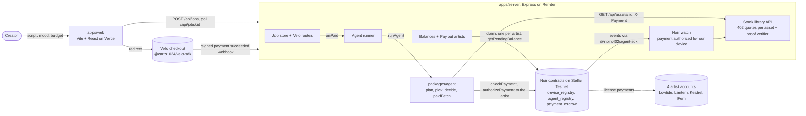
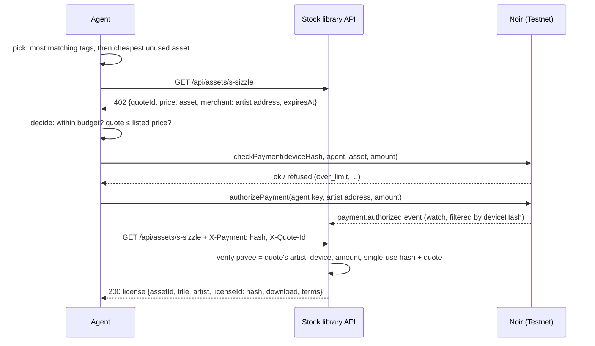

# Architecture

```mermaid
flowchart LR
  user([Creator]) -->|script, mood, budget| web[apps/web<br/>Vite + React on Vercel]
  web -->|POST /api/jobs, poll /api/jobs/:id| server
  web -->|redirect| velo[(Velo checkout<br/>@carts1024/velo-sdk)]
  velo -->|signed payment.succeeded webhook| server

  subgraph server[apps/server: Express on Render]
    jobs[Job store + Velo routes]
    runner[Agent runner]
    library[Stock library API<br/>402 quotes per asset + proof verifier]
    watch[Noir watch<br/>payment.authorized for our device]
    payout[Balances + Pay out artists]
  end

  jobs -->|onPaid| runner
  runner -->|runAgent| agent[packages/agent<br/>plan, pick, decide, paidFetch]
  agent -->|GET /api/assets/:id, X-Payment| library
  agent -->|checkPayment, authorizePayment to the artist| noir[(Noir contracts on Stellar Testnet<br/>device_registry, agent_registry, payment_escrow)]
  noir -->|events via @noirx402/agent-sdk| watch
  watch --> library
  payout -->|claim, one per artist, getPendingBalance| noir
  noir -.->|license payments| artists[(4 artist accounts<br/>Lowtide, Lantern, Kestrel, Fern)]
```

## One licensed asset

```mermaid
sequenceDiagram
  participant A as Agent
  participant L as Stock library API
  participant N as Noir (Testnet)
  A->>A: pick: most matching tags, then cheapest unused asset
  A->>L: GET /api/assets/s-sizzle
  L-->>A: 402 {quoteId, price, asset, merchant: artist address, expiresAt}
  A->>A: decide: within budget? quote ≤ listed price?
  A->>N: checkPayment(deviceHash, agent, asset, amount)
  N-->>A: ok / refused (over_limit, ...)
  A->>N: authorizePayment(agent key, artist address, amount)
  N-->>L: payment.authorized event (watch, filtered by deviceHash)
  A->>L: GET /api/assets/s-sizzle + X-Payment: hash, X-Quote-Id
  L->>L: verify payee = quote's artist, device, amount, single-use hash + quote
  L-->>A: 200 license {assetId, title, artist, licenseId: hash, download, terms}
```

Later, "Pay out artists" calls `claim` once per artist with a pending balance, signed by that artist's own key.
