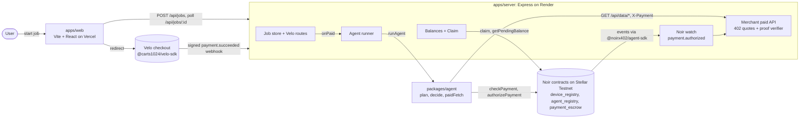
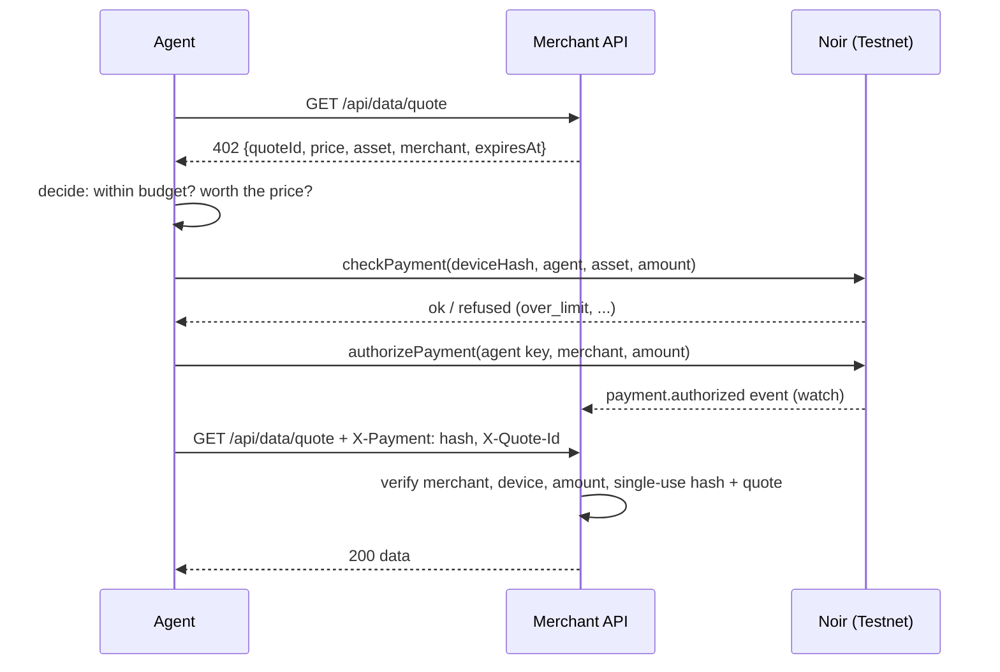

# Architecture

```mermaid
flowchart LR
  user([User]) -->|start job| web[apps/web<br/>Vite + React on Vercel]
  web -->|POST /api/jobs, poll /api/jobs/:id| server
  web -->|redirect| velo[(Velo checkout<br/>@carts1024/velo-sdk)]
  velo -->|signed payment.succeeded webhook| server

  subgraph server[apps/server: Express on Render]
    jobs[Job store + Velo routes]
    runner[Agent runner]
    merchant[Merchant paid API<br/>402 quotes + proof verifier]
    watch[Noir watch<br/>payment.authorized]
    claim[Balances + Claim]
  end

  jobs -->|onPaid| runner
  runner -->|runAgent| agent[packages/agent<br/>plan, decide, paidFetch]
  agent -->|GET /api/data/*, X-Payment| merchant
  agent -->|checkPayment, authorizePayment| noir[(Noir contracts on Stellar Testnet<br/>device_registry, agent_registry, payment_escrow)]
  noir -->|events via @noirx402/agent-sdk| watch
  watch --> merchant
  claim -->|claim, getPendingBalance| noir
```

## One paid call

```mermaid
sequenceDiagram
  participant A as Agent
  participant M as Merchant API
  participant N as Noir (Testnet)
  A->>M: GET /api/data/quote
  M-->>A: 402 {quoteId, price, asset, merchant, expiresAt}
  A->>A: decide: within budget? worth the price?
  A->>N: checkPayment(deviceHash, agent, asset, amount)
  N-->>A: ok / refused (over_limit, ...)
  A->>N: authorizePayment(agent key, merchant, amount)
  N-->>M: payment.authorized event (watch)
  A->>M: GET /api/data/quote + X-Payment: hash, X-Quote-Id
  M->>M: verify merchant, device, amount, single-use hash + quote
  M-->>A: 200 data
```
